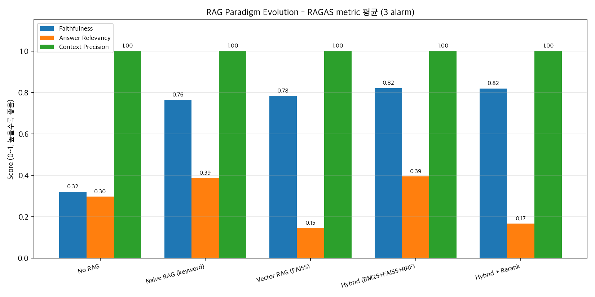
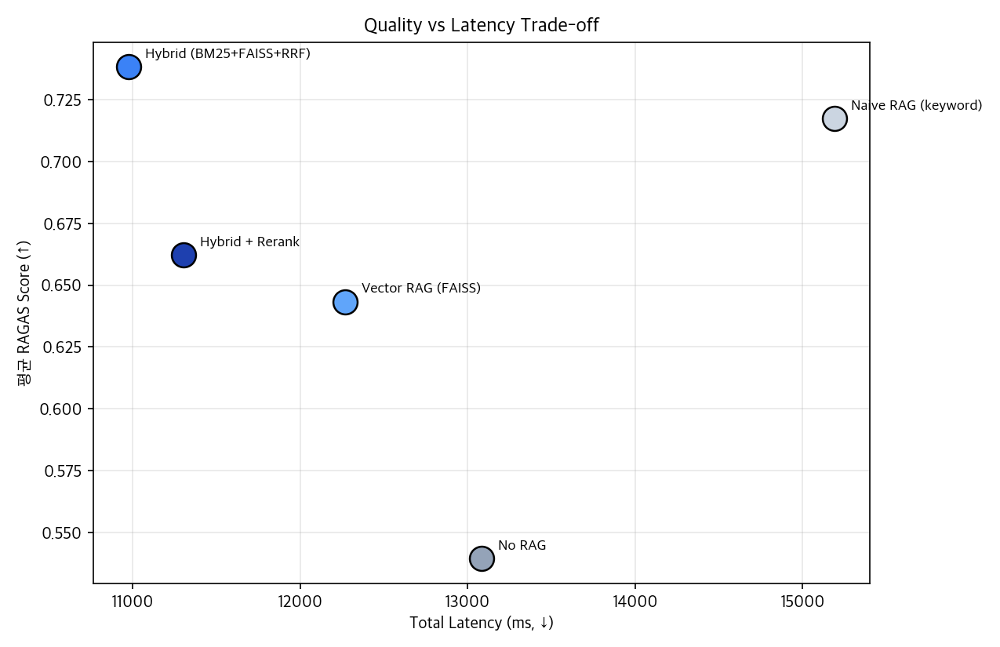
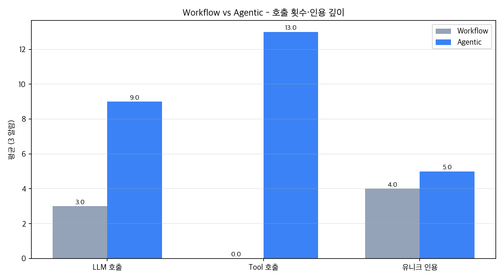
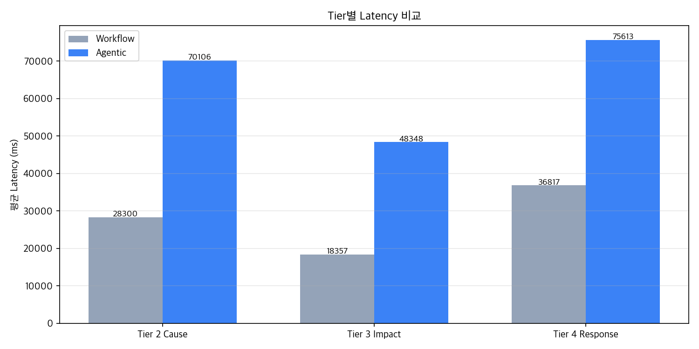
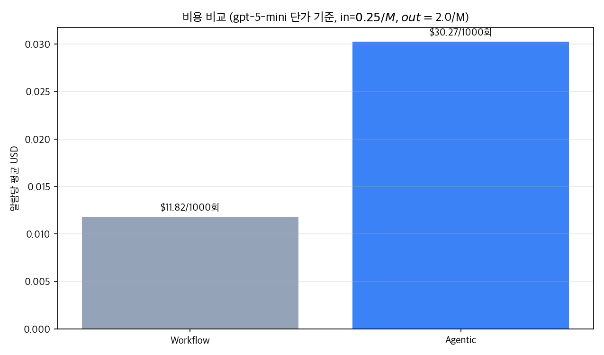
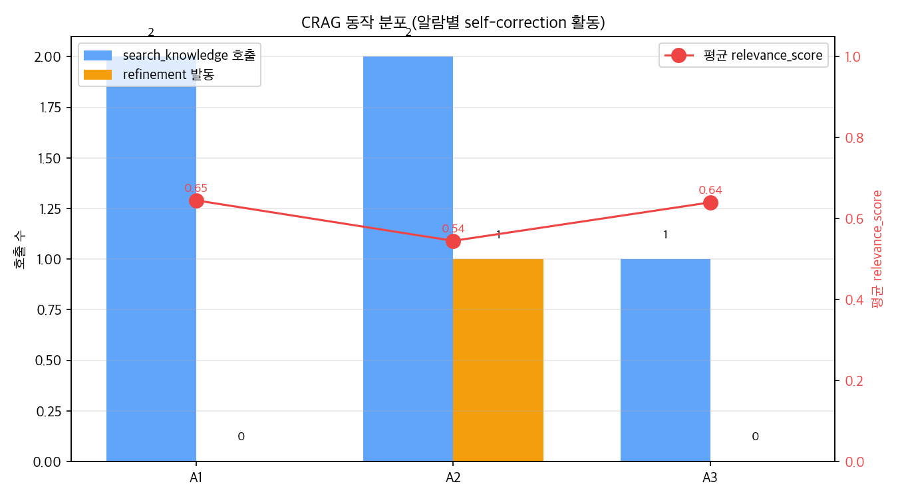
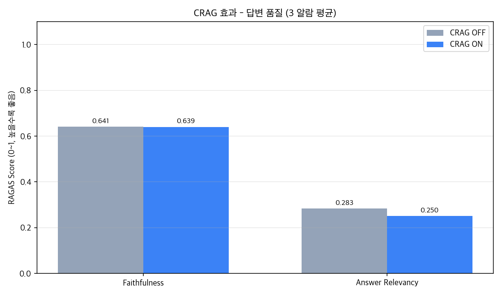

# FabAgent Experiments

핵심 의사결정마다 정량 비교 실험 + 트레이드오프 표 + 시행착오 기록을 남겨,
"왜 이 선택을 했는가"를 측정된 근거로 설명할 수 있게 합니다.

## 실험 목록

| ID | 실험 | 비교 대상 | 결정 | 결과 문서 |
|---|---|---|---|---|
| **D1** | Tier 1 이상 탐지 모델 | IsoForest / LOF / OC-SVM / baseline | IsolationForest | [tier1_detection/results.md](tier1_detection/results.md) |
| **D2** | Retrieval 백엔드 latency | keyword / FAISS / hybrid / +rerank | hybrid_rerank (latency) | [retrieval_compare/results.md](retrieval_compare/results.md) |
| **D5** | 멀티 에이전트 vs Single LLM | 분리·전문화 vs 통합 호출 | Multi-Agent | [multi_vs_single/results.md](multi_vs_single/results.md) |
| RAG-eval | RAGAS (hybrid vs hybrid_rerank) | 2 backend RAGAS 비교 | (D6에 통합) | [rag_eval/results.md](rag_eval/results.md) |
| **D6** | RAG paradigm 5단계 ablation | No RAG / Naive / FAISS / Hybrid / +Rerank | **Hybrid** | [rag_paradigm/results.md](rag_paradigm/results.md) |
| **D7** | Workflow vs Agentic | 단일 LLM 호출 vs tool-using 루프 | **Agentic** | [agentic_vs_workflow/results.md](agentic_vs_workflow/results.md) |
| **D8** | CRAG ON vs OFF | self-correction (grader + refinement) | CRAG **활성 유지** (관측 가치) | [crag_eval/results.md](crag_eval/results.md) |

## 핵심 결정 요약

### D1. 이상 탐지 모델 → **IsolationForest**

| 모델 | ROC-AUC | PR-AUC |
|---|---|---|
| **IsolationForest** | 0.600 | **0.129** |
| baseline | 0.565 | 0.119 |
| OC-SVM | 0.547 | 0.098 |
| LOF | 0.530 | 0.089 |

- SECOM은 비지도 이상 탐지가 어려운 표준 벤치마크 (문헌 ROC-AUC ~0.6 범위)
- 트레이드오프: Autoencoder/LSTM은 더 복잡한 패턴 가능하나 학습 데이터·시간 비용 큼

### D2. Retrieval 백엔드 latency → **4 backend 검증 (단순 latency 비교)**

| 백엔드 | 평균 latency |
|---|---|
| keyword | 0.5 ms |
| FAISS | ~60 ms |
| **hybrid** | ~54 ms |
| hybrid + rerank | ~326 ms |

- 의미 우회 쿼리에서 FAISS·hybrid가 keyword 압도
- 정밀도 평가는 D6 (RAG paradigm ablation)에서 RAGAS로 별도 진행

### D5. 멀티 에이전트 vs Single LLM → **Multi-Agent**

| 영역 | 우위 |
|---|---|
| 속도·비용 | Single (2.6x 빠름, 2.2x 저렴) |
| 응답 깊이 (조치 권고 수) | Multi (1.6~1.9x detailed) |
| 모듈화·확장성·자가학습 | Multi |
| schema·citation 정확도 | 동등 (양쪽 strict JSON 100%) |

- 비용 절대값이 두 방식 모두 $0.01~0.02로 미미해 cost-aware할 필요 없음
- 운영 환경(사업부별 Tier 책임자 분리, 새 step 확장)에서는 Multi의 모듈화가 결정적

### D6. RAG paradigm 5단계 ablation → **Hybrid (BM25+FAISS+RRF)**

| Paradigm | Faithfulness | Answer Relevancy | Context Precision | Total ms |
|---|---|---|---|---|
| No RAG | 0.321 | 0.297 | 1.000 | 13,084 |
| Naive RAG (keyword) | 0.764 | 0.388 | 1.000 | 15,192 |
| Vector RAG (FAISS) | 0.784 | 0.146 | 1.000 | 12,267 |
| **Hybrid (BM25+FAISS+RRF)** | **0.821** | **0.394** | **1.000** | **10,977** |
| Hybrid + Rerank | 0.819 | 0.167 | 1.000 | 11,306 |




**핵심 인사이트**:

1. **RAG 도입 효과가 결정적** - No RAG 대비 어떤 paradigm을 붙여도 faithfulness 2.5배↑
2. **Hybrid가 본 코퍼스에서 모든 지표 1위** - quality + latency 모두 우위. production 표준 패턴 (Microsoft Azure AI Search, LlamaIndex 권고)
3. **Cross-encoder Rerank는 본 코퍼스에서 역효과**
   - faithfulness 동급, answer_relevancy 0.394 → 0.167 낙폭
   - 원인 추정: ① 코퍼스 ~10문서로 Hybrid top-3이 이미 충분 ② `BAAI/bge-reranker-base`가 영어 학습 → 한국어 도메인 텍스트 점수 신호 잡음
   - 코퍼스 100+ 확장 또는 한국어 reranker(`dongjin-kr/ko-reranker`)로 재평가 권장

**시행착오**: 처음엔 "rerank가 production 표준이니까" 기본값으로 채택했으나, RAGAS 평가에서 데이터가 정반대 신호를 보내 기본값 변경 (`hybrid_rerank` → `hybrid`). **정량 평가 없으면 통념을 그대로 끌고 갈 뻔한 사례**.

### D7. Workflow vs Agentic → **Agentic** (tool-using agent)

| 지표 | Workflow | Agentic | 배수 |
|---|---|---|---|
| LLM 호출 / 알람 | 3 | 9 | x3.0 |
| Tool 호출 / 알람 | 0 | 13 | - |
| 유니크 인용 / 알람 | 4 | 5 | x1.25 |
| 입력 토큰 / 알람 | 5,890 | 20,474 | x3.5 |
| 출력 토큰 / 알람 | 5,174 | 12,574 | x2.4 |
| Latency (T2~T4) | 83s | 194s | x2.3 |
| 비용 / 1000알람 | $11.82 | $30.27 | x2.6 |





**채택 근거**:

1. **Tool 호출 로그 = reasoning trace** - "왜 이 권고가 나왔는가"의 audit trail 확보 (fab 안전성 결정적)
2. **Multi-source 근거 결합** - INC·FMEA·SOP·incident DB·PM 이력을 LLM이 자율적으로 결합
3. **비용 +$0.018/알람** - 일 수백 알람에도 일 $5 미만, 사업적 영향 무시 가능
4. **Latency 2.3배는 로딩 UI로 흡수** - 이미 4-Tier cascade 등장 UI 구현

**시행착오**: "4-Tier가 LLM 호출하니까 multi-agent다"라고 주장했다가, Anthropic의 [Building Effective Agents](https://www.anthropic.com/engineering/building-effective-agents) 정의로 자기 검증하니 **workflow였음** (각 Tier가 사전 RAG 1회 + LLM 1회). Tool-using 패턴으로 전환 후 인용 깊이는 +25% 정도지만, 도구 호출 로그가 reasoning trace이자 audit trail이 되는 게 결정적.

### D8. CRAG (Self-correction) → **활성 유지** (관측 가치)

| 지표 | CRAG OFF | CRAG ON | 변화 |
|---|---|---|---|
| Faithfulness | 0.641 | 0.639 | -0.1%p (동급) |
| Answer Relevancy | 0.283 | 0.250 | -3.3%p (소폭 하락) |
| LLM 호출 / 알람 | 3.0 | 3.7 | x1.22 |
| 비용 / 1000알람 | $9.40 | $12.29 | x1.31 |
| Latency (Tier 2) | 61s | 69s | x1.13 |
| Refinement 발동률 | - | **20%** | (5번 중 1번) |
| 평균 relevance_score | - | **0.61** | (CRAG ON에서 0~1로 가시화) |




**채택 근거 (솔직한 trade-off)**:

1. **품질 변화 사실상 없음** - faithfulness -0.1%p, relevancy -3.3%p. 본 코퍼스(~10문서)에선 hybrid가 이미 잘 작동
2. **자가 정정 메커니즘 자체는 작동 확인** - smoke test: gibberish 쿼리(`알수없음 xyzzy foobar`)에 avg score 0.0 부여 후 LLM이 `CMP 공정 실패 모드 분석...`으로 재작성, avg 0.0 → 0.68 회복
3. **인용 신뢰도 가시화 가치** - 답변마다 0~1 relevance_score 노출 → 운영자가 "이 권고가 얼마나 강한 근거에 기반하는가" 즉시 판단
4. **비용 +31% 절대값 무시 가능** - 1000 알람당 +$2.90
5. **agentic loop와의 부분 중복** - agent가 이미 부족한 결과를 보고 다른 query로 재호출하는 self-correction 일부 수행

**시행착오**: Anthropic·LangChain이 CRAG를 production 패턴으로 자주 언급. 단순 구현(grader + refiner) + smoke test에서 인상적 작동 확인. 그러나 정량 비교에서 **품질 변화 미미** - D6 Rerank와 같은 패턴. 작은 도메인 코퍼스에선 정교한 self-correction이 ROI 낮음. 정량 평가 없이는 "CRAG 도입했음" 마케팅으로 끝났을 것. 결정: **활성 유지하되 코퍼스 확장 시 재평가** (인용 신뢰도 노출이라는 부수 가치는 유지).

## 실행 방법

```bash
# Tier 1 모델 벤치마크 (D1)
.venv/bin/python -m experiments.tier1_detection.benchmark

# Retrieval latency 비교 (D2)
.venv/bin/python -m experiments.retrieval_compare.benchmark

# 멀티 에이전트 vs Single LLM (D5)
.venv/bin/python -m experiments.multi_vs_single.benchmark

# RAGAS hybrid vs hybrid_rerank
.venv/bin/python -m experiments.rag_eval.benchmark

# RAG paradigm 5단계 ablation (D6)
.venv/bin/python -m experiments.rag_paradigm.benchmark
# 차트만 재생성 (CSV 캐시 사용):
.venv/bin/python -m experiments.rag_paradigm.benchmark --charts-only

# Workflow vs Agentic (D7)
.venv/bin/python -m experiments.agentic_vs_workflow.benchmark

# CRAG ON vs OFF (D8)
.venv/bin/python -m experiments.crag_eval.benchmark
```

각 실험은 `results.md`와 `charts/*.png`를 생성합니다.
