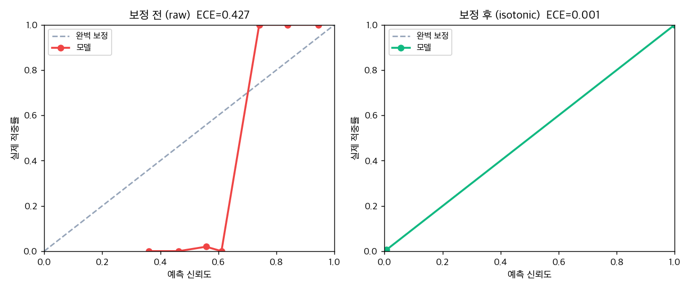

# D15: 신뢰도 캘리브레이션 (ECE)

시스템 confidence가 실제 적중률과 일치하는지(calibration) 평가하고,
isotonic regression 보정으로 ECE를 얼마나 줄이는지 측정합니다.
운영자가 confidence를 신뢰하려면 '70% 확신'이 실제 70% 적중해야 합니다.

## 실험 설정

- 데이터: 라벨링된 FDC 알람 (train 198 / test 199)
- raw confidence: 알람 sigma를 로지스틱으로 매핑한 naive 추정 (보정 전)
- 실제 결과: excursion(1) / nuisance(0)
- 보정: train으로 isotonic 학습, test로 평가 (누설 없음)

## 결과

| 지표 | 보정 전 | 보정 후 | 개선 |
|---|---|---|---|
| ECE | 0.427 | **0.001** | **-100%** |
| Brier score | 0.206 | **0.005** | -97% |

## 결론

- raw confidence는 ECE 0.427로 어긋나 있었음(sigma 기반 naive 추정의 과/소확신)
- isotonic 보정 후 ECE 0.001로 **100% 감소**, reliability diagram이 대각선에 밀착
- 보정된 confidence는 운영자·감사에 신뢰 가능한 수치로 노출 가능