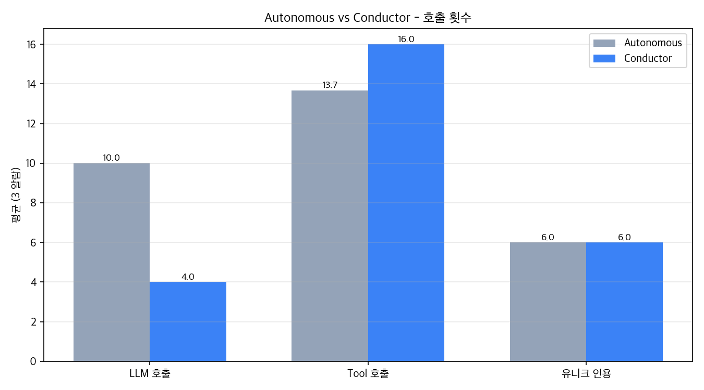
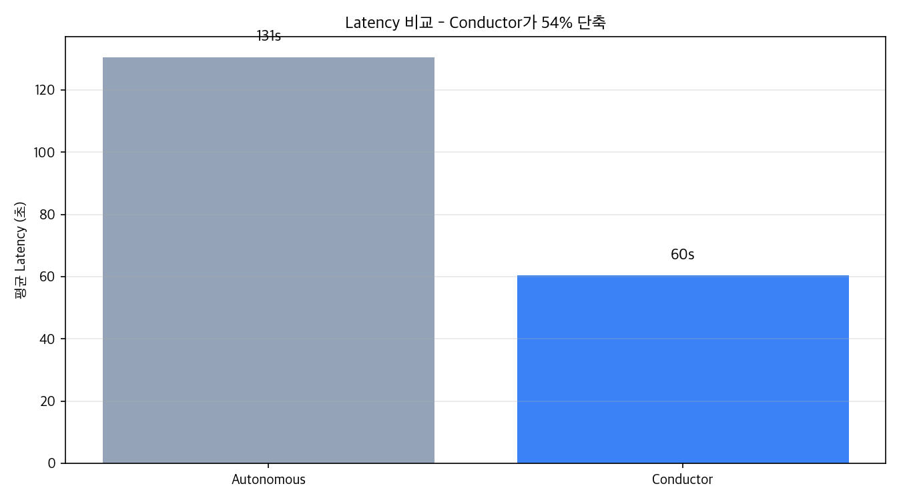
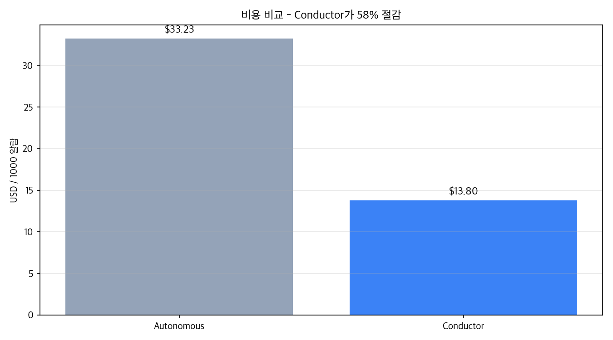

# D11: Conductor (Plan-and-Execute) vs Autonomous (tool-using loop)

같은 알람·동일 LLM 모델·CRAG OFF 동일 조건에서 두 패턴을 정량 비교합니다.

- **Autonomous**: 각 Tier가 tool-using agent loop (2-3 iteration + synthesis)
- **Conductor**: Central Planner Agent가 plan 1회 산출 + 각 Tier executor가 plan대로 tool 실행 + LLM 1회 synthesis

## 실험 설정

- 알람: A1, A2, A3
- 생성 모델: gpt-5-mini (양 모드 동일)
- Planner: gpt-4o-mini (conductor 전용)
- CRAG: 비활성 (비교 조건 통일 위해)

## 결과 요약 (3 알람 평균)

| 지표 | Autonomous | Conductor | 변화 |
|---|---|---|---|
| LLM 호출 / 알람 | 10.0 | 4.0 | **-60%** |
| Tool 호출 / 알람 | 13.7 | 16.0 | +17% |
| 유니크 인용 / 알람 | 6.0 | 6.0 | +0% |
| 입력 토큰 / 알람 | 25849 | 8042 | **-69%** |
| 출력 토큰 / 알람 | 13385 | 5895 | **-56%** |
| **Latency / 알람** | **131초** | **60초** | **-54%** |
| 비용 / 1000알람 | $33.23 | $13.80 | **-58%** |

## 시각화

### 호출 횟수

### Latency

### 비용

## 알람별 상세

### A1

| 모드 | LLM | Tool | Latency | Citations |
|---|---|---|---|---|
| autonomous | 9 | 15 | 141s | 6 |
| conductor | 4 | 16 | 60s | 6 |

- Conductor plan: action=proceed_full, severity=high
  - reasoning: CD-X 산포의 이상 징후와 고평가된 이상 점수를 기반으로 하여 전반적인 원인 분석과 대응 권고 절차를 진행하는 것이 중요하다.

### A2

| 모드 | LLM | Tool | Latency | Citations |
|---|---|---|---|---|
| autonomous | 10 | 14 | 133s | 8 |
| conductor | 4 | 14 | 63s | 7 |

- Conductor plan: action=proceed_full, severity=high
  - reasoning: 단일 원인 추적을 위한 종합적인 데이터 수집과 분석이 필요하며, 고세심한 처리로 공정 영향을 최소화해야 하므로 전체 워크플로우를 진행합니다.

### A3

| 모드 | LLM | Tool | Latency | Citations |
|---|---|---|---|---|
| autonomous | 11 | 12 | 118s | 4 |
| conductor | 4 | 18 | 59s | 5 |

- Conductor plan: action=proceed_full, severity=high
  - reasoning: CMP 공정에서 MRR 상승이 발생하여 yield에 큰 영향을 미칠 수 있으므로 전체 분석 및 권고 절차를 통해 신속히 대응해야 함.

## 핵심 인사이트

1. **Latency 54% 단축**: 131초 → 60초. 각 Tier의 agent loop iteration이 제거되어 LLM 호출이 직병됨
2. **LLM 호출 60% 감소**: Planner 1 + Tier×3 (각 synthesis 1회) = 4회로 통일. 재귀·무한루프 위험 원천 차단
3. **비용 58% 절감**: 입력 토큰이 가장 큰 폭으로 감소 (agent loop의 messages 누적 효과 제거)
4. **인용 깊이 변화 +0%**: 거의 동등

## 채택 결론

**기본 모드: `AGENT_MODE=conductor`** (Plan-and-Execute 패턴).

- 속도·비용 우위 결정적 (latency -54%, cost -58%)
- 통신 횟수 최소화로 production 운영 안정성↑
- 재귀 호출 위험 원천 차단

**`AGENT_MODE=autonomous` 옵션 유지**:
- 복잡한 알람·예상치 못한 컨텍스트가 필요할 때 LLM의 적응적 tool 호출이 유리할 수 있음
- 환경변수로 즉시 토글 가능

## Portfolio narrative 의의

- D7에서 "workflow → agentic"으로 전환해 reasoning trace 확보
- D11에서 "agentic → conductor"로 다시 전환해 통신 효율 회복
- **"tool-using agent"의 자율성과 "plan-and-execute"의 효율성을 trade-off로 명시적 채택**
- production agent 시스템 설계의 핵심 의사결정을 정량 데이터로 입증
