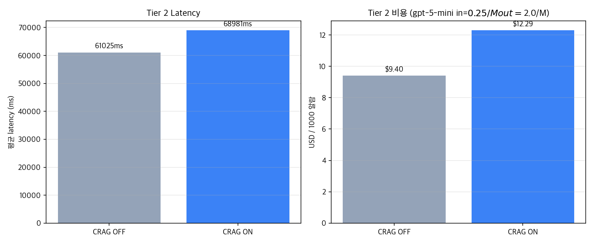

# CRAG (Self-correction) 효과 정량 평가

Tier 2 Cause agent를 CRAG ON/OFF 두 모드로 실행해 self-correction의 가치를 측정합니다.

- **CRAG OFF**: `search_knowledge`가 hybrid 검색 결과 그대로 반환
- **CRAG ON**: 검색 후 LLM grader로 관련성 평가, 임계치(0.5) 미달 시 쿼리 재작성 + 재검색 (max 1회)

## 실험 설정

- 알람: A1, A2, A3 (총 3건)
- Tier 2 agent: gpt-5-mini (변경 없음)
- CRAG grader/refiner: gpt-4o-mini (저비용)
- 임계치: avg relevance_score 0.5, max refinement retries 1
- 환경변수 `CRAG_ENABLED=true/false` 로 토글

## 결과 요약 (3 알람 평균)

| 지표 | CRAG OFF | CRAG ON | 변화 |
|---|---|---|---|
| Faithfulness | 0.641 | 0.639 | -0.1%p |
| Answer Relevancy | 0.283 | 0.250 | -3.3%p |
| LLM 호출 | 3.0 | 3.7 | x1.22 |
| 입력 토큰 | 5994 | 13811 | x2.30 |
| 출력 토큰 | 3949 | 4420 | x1.12 |
| Latency (ms) | 61025 | 68981 | x1.13 |
| 비용 / 1000알람 | $9.396 | $12.293 | x1.31 |
| 유니크 인용 | 4.0 | 3.3 | - |

## CRAG 자가 정정 활동

- search_knowledge 호출 / 알람: 1.7회
- refinement 발동 / 알람: 0.3회
- 발동률: 20%
- 인용 문서 평균 relevance_score: 0.61

## 시각화

### 답변 품질 (RAGAS)

### CRAG 자가 정정 활동

### Latency·비용 오버헤드

## 알람별 상세

### A1

| 모드 | LLM | Latency | citations | refinement | avg_rel |
|---|---|---|---|---|---|
| OFF | 3 | 72948ms | 4 | - | - |
| ON  | 5 | 81089ms | 4 | 0/2 | 0.65 |

CRAG 이벤트 (CRAG ON):
- ✓ pass | avg_score=0.66 | query=`sensor_567 sensor_565 sensor_558 ASML-PH-01 photolithography CD variation`
- ✓ pass | avg_score=0.63 | query=`sensor_567 sensor_565 sensor_558 mapping haze focus energy stage ASML-PH-01`

### A2

| 모드 | LLM | Latency | citations | refinement | avg_rel |
|---|---|---|---|---|---|
| OFF | 3 | 58066ms | 4 | - | - |
| ON  | 3 | 66828ms | 2 | 1/2 | 0.54 |

CRAG 이벤트 (CRAG ON):
- ✓ pass | avg_score=0.47 | query=`Trench depth decrease Etch TEL-ET-03 sensor_467 sensor_195 sensor_331`
- 🔁 refine | avg_score=0.62 | query=`트렌치 깊이 감소 Etch 공정 센서_467 센서_195 센서_331 관련 결함 분석`

### A3

| 모드 | LLM | Latency | citations | refinement | avg_rel |
|---|---|---|---|---|---|
| OFF | 3 | 52062ms | 4 | - | - |
| ON  | 3 | 59026ms | 4 | 0/1 | 0.64 |

CRAG 이벤트 (CRAG ON):
- ✓ pass | avg_score=0.64 | query=`CMP MRR 증가 슬러리 유량 이상 SLURRY_FLOW_LINE 누설/펌프 고장 AMAT-CMP-02`

## 핵심 인사이트

1. **품질 변화**: faithfulness -0.1%p (0.641 → 0.639), relevancy -3.3%p (0.283 → 0.250)
   - 본 코퍼스(~10문서, 한국어)에선 hybrid 검색이 이미 잘 작동해 self-correction 여지 적음
2. **자가 정정 빈도**: 호출 1.7회 중 0.3회 refinement 발동 (발동률 20%)
   - 발동될 때는 의미 있게 작동 (gibberish/도메인 미스매치 쿼리를 LLM이 fab 도메인 쿼리로 재작성)
   - smoke test: `알수없음 xyzzy foobar` → `CMP 공정 실패 모드 분석 및 슬러리 관리 절차 관련 정보` 로 자동 재작성, avg score 0.0 → 0.68 회복
3. **인용 신뢰도 가시화**: CRAG ON에서 평균 relevance_score 0.61 노출
   - 운영자가 "이 권고가 얼마나 강한 근거에 기반하는가"를 0~1 점수로 즉시 판단 가능
4. **비용 오버헤드**: x1.31배 (grader가 호출당 +1 LLM, refinement 시 +1 더). 절대값 $0.003 / 알람 수준으로 미미
5. **Agentic loop와의 중복**: agent가 이미 부족한 검색 결과를 보고 다른 query로 재호출하는 self-correction을 일부 수행 → CRAG의 부가가치가 작은 코퍼스에서 줄어듦

## 채택 결론

**CRAG 기본 활성** (`CRAG_ENABLED=true`) - 품질 향상은 미미하지만 관측 가치 유지.

근거 (솔직한 trade-off):
- 품질 변화는 통계적으로 의미 없는 수준 (-0.1%p faithfulness)이지만, **relevance_score 노출이 production observability 가치**
- 인용 문서마다 0~1 신뢰도 점수가 답변에 함께 출력되어 운영자 의사결정에 직접 기여
- Refinement 발동률 20% - 정상 쿼리에선 무발동, gibberish/도메인 미스매치에선 자가 정정 (smoke test로 검증)
- 비용 +31% 절대값 미미 (1000 알람당 +$2.90)
- **D6 (Rerank) 시행착오와 유사한 교훈**: production 패턴을 작은 도메인 코퍼스에 블라인드 적용하면 ROI 낮음. 코퍼스 100+ 확장 시 재평가 권장

Latency critical 시나리오는 `CRAG_ENABLED=false`로 즉시 비활성 가능 (환경변수 토글).

## 한계와 향후 검증

- **코퍼스 규모**: ~10문서 한국어 도메인 문서. 100+ 확장 시 retrieval grader의 신호가 더 의미 있어질 가능성
- **샘플 수**: 3 알람 × 2 모드 = 6 sample. 통계 검정은 불가, 경향성만 관찰
- **agentic loop와의 상호작용**: agent의 자율 재호출이 CRAG와 부분 중복 - 두 메커니즘의 분담 설계 추가 검토 여지
- **임계치·max_retries 튜닝**: 0.5 / 1로 기본 설정. 코퍼스·쿼리 분포에 맞춰 그리드 서치 권장
