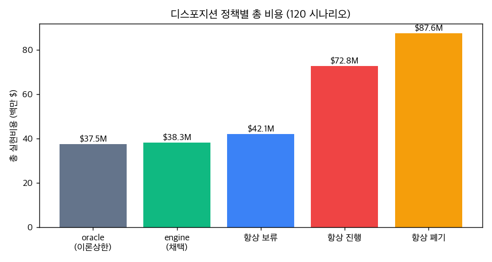
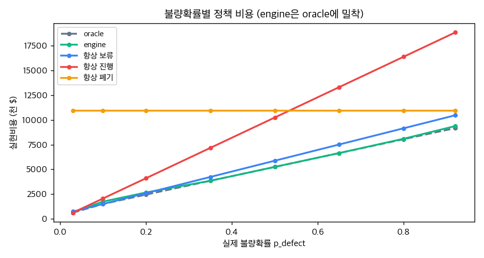

# D13: 리스크 정량 디스포지션 vs naive 정책

영향 WIP 처리 결정(진행/보류/재작업/폐기)을 기대비용 엔진으로 내릴 때,
현장에서 흔한 naive 정책 대비 비용을 얼마나 아끼는지 정량 평가합니다.
비용 계산은 전적으로 결정론이라 100% 재현됩니다(seed 고정).

## 실험 설정

- 시나리오 120건: 공정 5종 × p_defect 8수준 × 영향수 3종
- oracle: 실제 p로 기대비용 최소 결정 (이론 상한)
- engine: 추정 p(실제 + 노이즈 σ=0.1)로 결정 (분석 추정오차 모사)
- naive: 항상 보류 / 항상 진행 / 항상 폐기
- 실현비용: 어떤 결정이든 '실제 p'에서의 기대비용으로 평가

## 결과: 총 실현비용

| 정책 | 총 비용 | oracle 대비 |
|---|---|---|
| oracle (이론상한) | $37.52M | +0.0% |
| engine (채택) | $38.28M | +2.0% |
| 항상 보류 | $42.07M | +12.1% |
| 항상 진행 | $72.78M | +93.9% |
| 항상 폐기 | $87.60M | +133.4% |

## engine 품질

| 지표 | 값 |
|---|---|
| oracle 결정 일치율 | **84%** |
| 평균 regret (engine - oracle) | $6.3K / 시나리오 |
| engine 총비용 oracle 초과 | **+2.0%** |

## naive 정책 대비 절감액

| 비교 | 절감액 | 절감률 |
|---|---|---|
| vs 항상 보류 | $3.79M | 9.0% |
| vs 항상 진행 | $34.49M | 47.4% |
| vs 항상 폐기 | $49.32M | 56.3% |

## 결론

- 비용엔진은 oracle 결정을 **84%** 재현, 총비용은 이론상한 대비 **+2.0%**에 불과
- 항상 진행(출하)은 고위험 구간에서 폭증, 항상 폐기는 저위험 구간에서 낭비 → engine은 p에 따라 적응
- 모든 결정에 기대비용·신뢰구간·입력을 노출 → 관리자가 $ 근거로 결재 가능 (감사성)