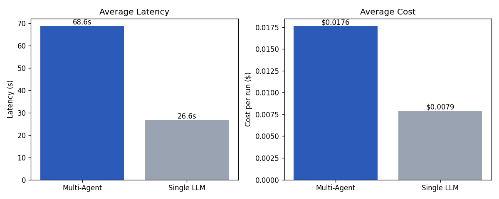

# D5. Multi-Agent vs Single LLM

동일 알람 **A3 (CMP Step 이상)** 에 대해 두 방식을 N=3회씩 실행한 비교 결과입니다.

## 실험 설정

- 모델: `gpt-5-mini` (양쪽 동일, 공정한 비교)
- 알람: A3 (CMP Step 이상), lot L20240510-N-08
- Tier 1 (이상 탐지): 점수 0.95 / 기여 센서 `SLURRY_FLOW_LINE_B/A/C`
- Tier 1 결과는 양쪽 동일 입력, **Tier 2/3/4만 비교**
- Multi-Agent: cause → impact → response 순차 호출 (각 전문화된 system prompt + 좁은 RAG context)
- Single LLM: 전체 지식 문서 + Tier 1을 한 번에 입력, Tier 2/3/4 통합 JSON 산출

## 정량 비교

| 지표 | Multi-Agent | Single LLM | 우위 |
|---|---|---|---|
| 스키마 부합률 | 100% | 100% | 동등 (양쪽 structured output) |
| Citation 정확도 | 100% | 100% | 동등 |
| Latency (avg) | 68.6 s | 26.6 s | **Single (2.6배 빠름)** |
| Cost/run | $0.0176 | $0.0079 | **Single (2.2배 저렴)** |
| Input tokens (avg) | 9,987 | 4,452 | Single |
| Output tokens (avg) | 7,555 | 3,390 | Single |
| 즉시 조치 수 (avg) | 9.3건 | 5.7건 | **Multi (1.6배 detailed)** |
| 중장기 조치 수 (avg) | 9.7건 | 5.0건 | **Multi (1.9배 detailed)** |
| Yield_loss σ (안정성) | 1.73 | 0.29 | Single (좁은 분산) |
| 원인 일관성 (Jaccard) | 0.00 | 0.00 | 동등 (N=3 한계) |

## 해석

### Single LLM이 우위인 영역

- **속도·비용**: 1회 호출이라 latency 2.6배 빠르고 비용 2.2배 저렴
- **수치 안정성**: yield_loss 추정의 표준편차가 더 작음 (한 번에 전체 맥락을 보므로 일관된 추정)

### Multi-Agent가 우위인 영역

- **응답 깊이**: 즉시 조치 1.6배, 중장기 조치 1.9배 많은 권고 — Tier별 전문화된 prompt가 detailed한 추론 유도
- **모듈화**: Tier별 독립 검증·교체·재학습 가능
- **확장성**: 새 step/사업부 추가 시 에이전트 추가만으로 확장 (Single은 prompt 통째 재설계 필요)
- **자가 학습**: 운영자 승인 시 Tier별 정밀한 인시던트 기록 (Single은 분리되지 않은 통합 출력)

### 한계

- N=3로는 원인 일관성(Jaccard) 의미 있는 차이 측정 어려움 — LLM stochasticity로 매 호출마다 다른 원인 도출되어 두 방식 모두 0
- citation/schema는 양쪽 strict JSON mode로 100%여서 변별력 없음

## 결론

**Multi-Agent 채택**. 근거:

1. **운영 환경 적합성** — 실 fab에서는 Tier별 책임자(탐지팀·원인분석팀·수율팀·운영팀)가 다름. 멀티 에이전트의 모듈 분리가 조직 구조와 일치
2. **자가 학습 루프** — Tier별 분리 기록이 다음 분석의 검색 정확도를 높이는 데 적합
3. **비용 차이 무시 가능** — 두 방식 모두 알람당 $0.01~0.02로 절대값 미미. 대규모 fab 운영(일 수백 알람)에서도 일 $10 미만
4. **응답 깊이 우위** — 즉시·중장기 조치 권고 수가 1.6~1.9배 많아 운영자의 의사결정 자료 풍부

**Single LLM이 더 적합한 케이스**: 단순 요약/분류 응답, 모듈 확장이 필요 없는 단일 도메인.

## 시행착오 (Lessons Learned)

- 초기 표는 화살표(🔻🔺) 기반이라 의미 해석이 헷갈렸음. "우위" 텍스트 컬럼이 더 명확
- N=3는 일관성 평가에 부족 — 향후 N=10+ 또는 동일 prompt에 `temperature=0` 적용으로 일관성 분리 측정 필요
- 양쪽 모두 strict JSON mode 사용해서 schema·citation 차이가 없음 — quality 비교를 위해 strict 끄거나 더 까다로운 schema로 평가 필요 (확장 실험)
