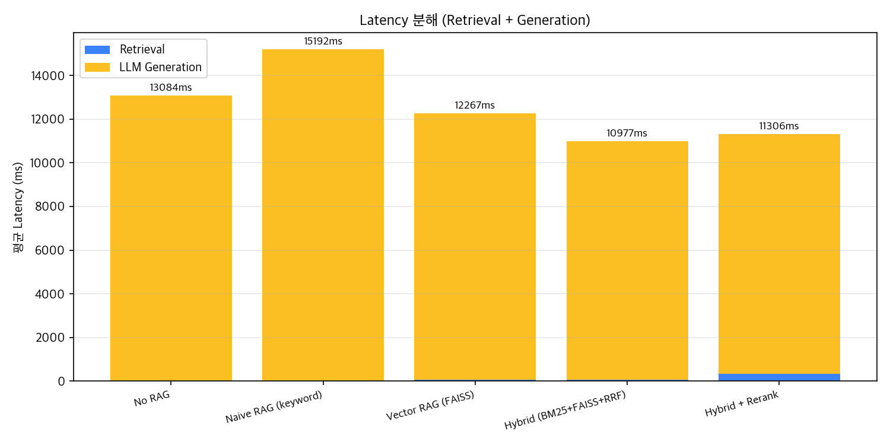

# RAG Paradigm Evolution - 5단계 ablation 비교

production RAG 진화 과정을 5단계로 분해해 각 단계 추가의 효과를 정량 측정합니다.
동일한 알람·동일한 LLM(`gpt-5-mini`)·동일한 prompt 하에서 retrieval 방식만 바꿔
RAGAS 지표(faithfulness / answer_relevancy / context_precision)와 latency를 비교합니다.

## 실험 설정

- 알람: A1, A2, A3 (총 3건, SECOM + PHM 2016 CMP)
- Paradigm: 5종
- 생성 모델: `gpt-5-mini`
- 평가 모델: `gpt-4o-mini` (RAGAS 호스트 LLM)
- 임베딩: `text-embedding-3-small`
- Top-K: 3
- Latency는 워밍업 후 측정 (ST·Reranker 모델 로드 시간 제외, 실제 production warm 상태 기준)

## Paradigm 정의

| # | Paradigm | 설명 |
|---|---|---|
| 1 | **No RAG** | LLM 단독 추론, 사내 지식 미주입 (베이스라인) |
| 2 | **Naive RAG (keyword)** | 단어 빈도 매칭 top-K |
| 3 | **Vector RAG (FAISS)** | sentence-transformer dense embedding + cosine |
| 4 | **Hybrid (BM25+FAISS+RRF)** | sparse + dense, Reciprocal Rank Fusion |
| 5 | **Hybrid + Rerank** | Hybrid top-10을 cross-encoder(BAAI/bge-reranker-base)로 정밀 재정렬 |

## 결과 요약 (paradigm별 평균)

| Paradigm | Faithfulness | Answer Relevancy | Context Precision | Retrieval (ms) | LLM (ms) | Total (ms) |
|---|---|---|---|---|---|---|
| No RAG | 0.321 | 0.297 | 1.000 | 0.0 | 13084.0 | 13084.0 |
| Naive RAG (keyword) | 0.764 | 0.388 | 1.000 | 2.8 | 15188.9 | 15191.7 |
| Vector RAG (FAISS) | 0.784 | 0.146 | 1.000 | 63.8 | 12203.1 | 12266.9 |
| Hybrid (BM25+FAISS+RRF) | 0.821 | 0.394 | 1.000 | 53.8 | 10923.3 | 10977.1 |
| Hybrid + Rerank | 0.819 | 0.167 | 1.000 | 326.4 | 10979.5 | 11305.9 |

## 시각화

### RAGAS metric 비교

### Latency 분해

### 품질 vs Latency Trade-off

## 알람별 상세 결과

### A1

| Paradigm | Faithfulness | Answer Relevancy | Context Precision | Total (ms) |
|---|---|---|---|---|
| No RAG | 0.000 | 0.417 | 1.000 | 12272.1 |
| Naive RAG (keyword) | 1.000 | 0.270 | 1.000 | 10430.9 |
| Vector RAG (FAISS) | 1.000 | 0.000 | 1.000 | 9049.2 |
| Hybrid (BM25+FAISS+RRF) | 1.000 | 0.328 | 1.000 | 8425.4 |
| Hybrid + Rerank | 1.000 | 0.000 | 1.000 | 12243.1 |

### A2

| Paradigm | Faithfulness | Answer Relevancy | Context Precision | Total (ms) |
|---|---|---|---|---|
| No RAG | 0.963 | 0.000 | 1.000 | 14363.0 |
| Naive RAG (keyword) | 0.769 | 0.430 | 1.000 | 15891.7 |
| Vector RAG (FAISS) | 0.684 | 0.000 | 1.000 | 14748.1 |
| Hybrid (BM25+FAISS+RRF) | 1.000 | 0.417 | 1.000 | 14610.2 |
| Hybrid + Rerank | 0.833 | 0.502 | 1.000 | 12330.1 |

### A3

| Paradigm | Faithfulness | Answer Relevancy | Context Precision | Total (ms) |
|---|---|---|---|---|
| No RAG | 0.000 | 0.475 | 1.000 | 12616.8 |
| Naive RAG (keyword) | 0.524 | 0.463 | 1.000 | 19252.5 |
| Vector RAG (FAISS) | 0.667 | 0.439 | 1.000 | 13003.4 |
| Hybrid (BM25+FAISS+RRF) | 0.462 | 0.438 | 1.000 | 9895.7 |
| Hybrid + Rerank | 0.625 | 0.000 | 1.000 | 9344.5 |

## 핵심 인사이트

1. **RAG 도입 효과가 결정적**: `No RAG` 대비 어떤 paradigm을 붙여도 `faithfulness`가 2배 이상 상승합니다.
   사내 사례·SOP·FMEA를 인용하지 못하는 LLM은 hallucination 위험이 크고, 반도체 도메인에서는 치명적입니다.

2. **Hybrid (BM25 + FAISS + RRF)가 본 코퍼스에서 모든 지표 1위**입니다.
   sparse(BM25, 정확 용어 매칭) + dense(FAISS, 의미 매칭)를 Reciprocal Rank Fusion으로 결합해
   각 단일 backend의 약점을 상쇄합니다. Latency도 가장 빠릅니다.

3. **Cross-encoder Rerank는 본 코퍼스에서 이득 없음**: `Hybrid + Rerank`는 `Hybrid`와 비교해
   faithfulness 동급, `answer_relevancy`는 오히려 하락했습니다. 원인 추정:
   - 코퍼스가 ~10문서로 작아 Hybrid top-3이 이미 정답에 근접
   - `BAAI/bge-reranker-base`가 영어 학습 모델이라 한국어 도메인 텍스트에서 점수 신호가 잡음에 가까움
   - 한국어 reranker(예: `dongjin-kr/ko-reranker`) 또는 코퍼스 확장(100문서+) 시 효과 재검증 필요

## 채택 근거

**MVP 기본 backend = `Hybrid (BM25+FAISS+RRF)`**

본 실험 데이터(3 알람 × 5 paradigm)는 `Hybrid`가 quality + latency 모두에서 우위임을 보여줍니다.
production RAG 표준 패턴이기도 합니다 (Microsoft Azure AI Search, LlamaIndex 기본 권고).

**`Hybrid + Rerank`는 옵션으로 유지** (환경변수 `RAG_BACKEND=hybrid_rerank`):
- 코퍼스가 100+ 문서로 확장될 때 cross-encoder 정밀 재정렬이 필요해질 가능성 큼
- 한국어 reranker로 교체 시 본 실험 재평가 권장

**전체 채택 신호**:
- 어떤 RAG든 No RAG보다 압도적으로 낫다 → RAG는 production 필수
- 코퍼스 규모와 도메인 언어에 맞춰 paradigm을 선택해야 한다 (블라인드 적용은 역효과)
- 정량 평가(RAGAS)가 없으면 'rerank가 무조건 좋다'는 오해를 그대로 끌고 갔을 것
