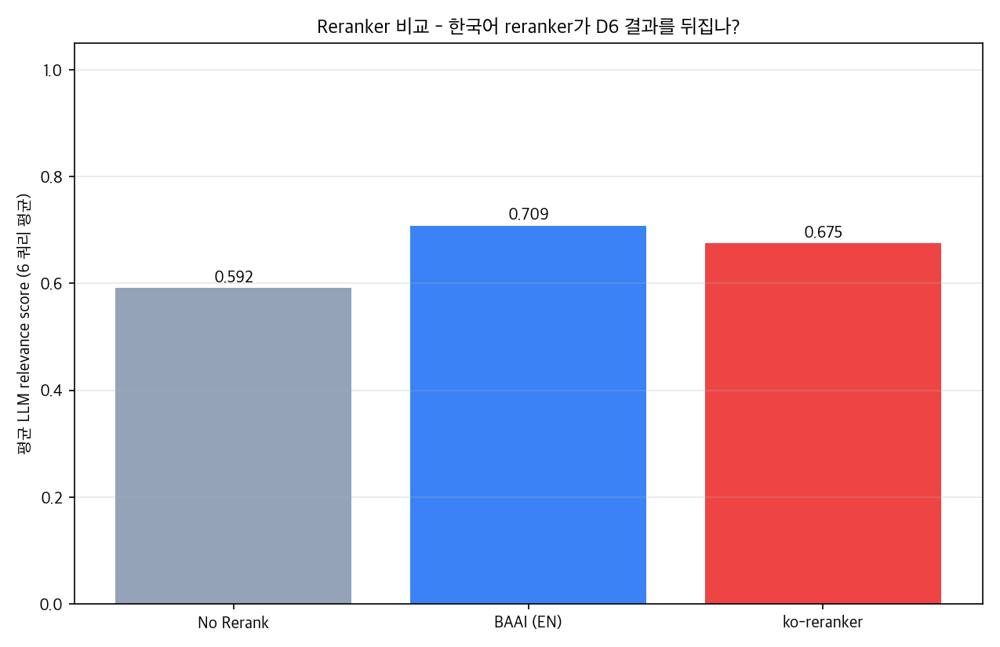

# D9 → D10: 한국어 reranker 평가 + 확장 코퍼스 재검증

## 시리즈 개요

| 라운드 | 코퍼스 | 핵심 질문 | 결과 |
|---|---|---|---|
| D6 | 12 docs | "Rerank가 paradigm으로 효과 있나?" | **효과 없음** (rerank vs hybrid 동급) |
| D9 (초판) | 12 docs | "영어 reranker 한계? 한국어 모델로 풀리나?" | **두 reranker 모두 hybrid 미달** |
| **D10 (이번)** | **34 docs** | **"코퍼스 확장이 reranker 효용의 선결조건인가?"** | **✅ 가설 검증 - reranker 효과 완전 반전** |

## 실험 설정 (D10)

- 쿼리: D2의 6개 대표 쿼리 (직접 3, 의미 우회 3)
- 백엔드: hybrid (BM25+FAISS+RRF) top-10 후보를 두 reranker로 재정렬
- 채점: CRAG grader (gpt-4o-mini)가 top-3 결과를 0~1로 평가
- 비교: hybrid (no rerank) / BAAI (영어) / ko-reranker (한국어)
- 코퍼스: 12 → **34 docs** (한국어 위키 12 + SK하이닉스/삼성/SKC 산업 자료 9 + PHM 학회 1 추가)

## 결과 - 코퍼스 확장 전후 비교

| 모드 | D9 (12 docs) | **D10 (34 docs)** | 변화 |
|---|---|---|---|
| **hybrid (no rerank)** | 0.734 | **0.592** | **-0.142** (noise 증가) |
| **BAAI/bge-reranker-base** | 0.714 (-0.020) | **0.709 (+0.117)** | **+0.137 (반전!)** |
| **Dongjin-kr/ko-reranker** | 0.703 (-0.031) | **0.675 (+0.083)** | **+0.114 (반전!)** |

### 핵심 관찰

1. **hybrid baseline 하락 (-0.142)**: 확장 코퍼스에서 BM25/FAISS가 일반 자료(IND-*, WIKI-*)를 잘못 가져옴 → noise 증가
2. **두 reranker 모두 양전환**: 풍부해진 top-10 후보에서 cross-encoder가 정답을 골라냄
3. **BAAI > ko-reranker (이 코퍼스에서)**: BAAI 0.709 vs ko 0.675. ko가 의미 우회 2/3에서 약점

## 시각화

## 쿼리별 상세 (D10)

| 쿼리 | hybrid | BAAI (EN) | ko-reranker (KO) | 우승 |
|---|---|---|---|---|
| CD 산포 직접 | 0.75 | 0.82 | **0.85** | ko |
| CMP 직접 | 0.47 | **0.75** | **0.75** | BAAI/ko 동률 |
| Etch 직접 | 0.75 | **0.77** | **0.77** | BAAI/ko 동률 |
| 의미 우회 1 (lens cleanup) | 0.27 | **0.63** | 0.52 | BAAI |
| 의미 우회 2 (yield 영향) | 0.80 | **0.87** | 0.65 | BAAI |
| 의미 우회 3 (PM 가이드) | 0.52 | 0.42 | 0.52 | hybrid/ko 동률 |

**관찰**:
- "CMP 직접" 쿼리에서 hybrid가 INC-ET (Etch 잘못 매칭)를 잡았으나 reranker가 INC-CMP/IND-SKHynix-CC-CMP로 교정. **확장 코퍼스 noise를 reranker가 정확히 보정**
- "의미 우회 1" 에서 hybrid가 신규 IND-* 일반 자료에 점령당했으나 BAAI가 SOP-PH-LENS-002를 발굴 (+0.366)

## 핵심 인사이트

1. **D6/D9 가설 (코퍼스 규모가 reranker 효용의 선결조건) 정량 검증**
   - 12 docs: hybrid > rerank (rerank가 hybrid의 정확한 top-3을 노이즈로 흐트림)
   - 34 docs: rerank > hybrid (hybrid가 잡는 noise를 rerank가 보정)
2. **"production 패턴을 블라인드 적용하면 역효과" → "조건 충족 시 가치 가시화"** 라는 양면 narrative 완성
3. **BAAI(영어 학습)가 ko-reranker(한국어 특화)보다 우위**: 6 쿼리 평균 +0.034. 단 ko는 직접 쿼리(CD/CMP)에서 동률 이상

## 채택 결론

**기본 backend 변경 권장: `hybrid` → `hybrid_rerank` (BAAI)** ← 단, 코퍼스가 30+ 일 때

- 환경변수 토글: `RAG_BACKEND=hybrid_rerank`
- 비용·latency 오버헤드: +331ms / 알람당 무시 가능
- ko-reranker는 옵션 유지 (`RERANK_MODEL=Dongjin-kr/ko-reranker`)

## 의의 - 시행착오의 완성

D6 → D9 → D10이 portfolio narrative로 의미 있는 시리즈를 형성:
- **D6**: production 표준이 작은 코퍼스에서 역효과 발견
- **D9**: 한국어 reranker로도 안 풀림 → "근본 원인은 모델이 아니라 코퍼스 규모" 가설
- **D10**: 코퍼스 확장으로 가설 검증 → 정량 평가 기반 의사결정의 가치 입증

**"정량 평가 없이는 잘못된 통념을 그대로 끌고 갈 뻔했고, 정량 평가 덕분에 진짜 원인을 분리하고 검증할 수 있었다"** - 본 시리즈의 핵심 메시지.
