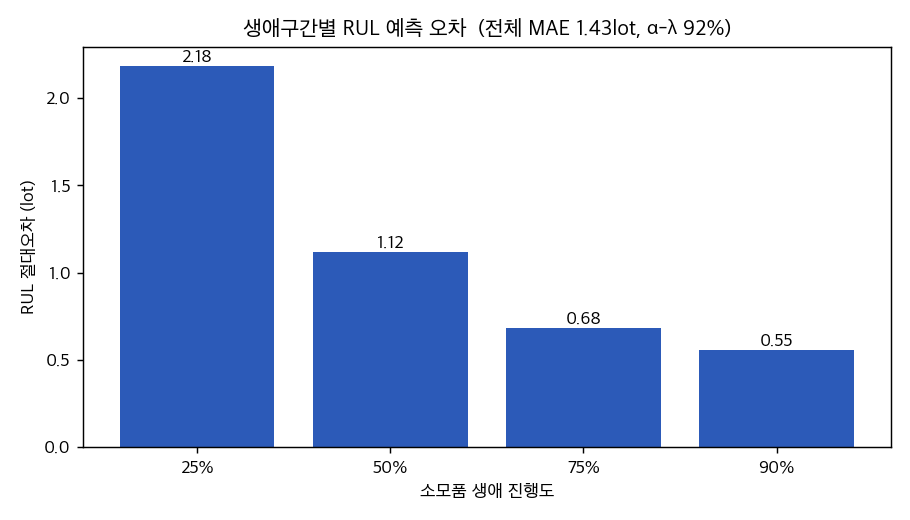
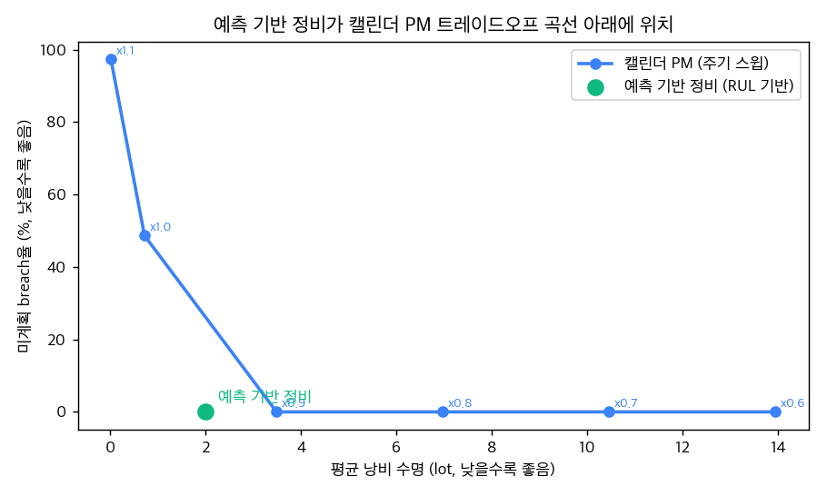

# D14: RUL 예측 + 예측 기반 정비 vs 캘린더 PM

반응형에서 예측형으로의 전환 가치를 정량 평가합니다. 소모품 마모 추세를
외삽해 잔여수명(RUL)을 예측하고, 고정 주기 캘린더 PM(현 fab 관행) 대비
미계획 breach와 낭비 수명을 얼마나 줄이는지 측정합니다.

## 실험 설정

- 소모품 3종(연마 패드·드레서·멤브레인) × RtF 궤적 50개 = 150개
- 수명한계·MRR 열화율은 PHM 2016 CMP 실데이터에서 도출, 궤적은 거기 보정된 합성
- 예측 기반 정비 트리거: 예측 RUL ≤ 2 lot, 캘린더 PM: 고정 주기 스윕

## 1. RUL 예측 정확도

| 지표 | 값 |
|---|---|
| 예측 시점 수 | 4,780 |
| MAE | **1.43 lot** |
| RMSE | 2.36 lot |
| α-λ accuracy (±20%) | **92%** |
| 편향 (예측-실제) | -0.19 lot (보수적) |

생애 후반으로 갈수록 오차가 줄어, breach 임박 시점에서 정확도가 가장 높습니다.

## 2. 예측 기반 정비 vs 캘린더 PM

| 정책 | 미계획 breach율 | 평균 낭비 수명 |
|---|---|---|
| **예측 기반 정비 (RUL 기반)** | **0%** | **2.0 lot** |
| 캘린더 PM (주기 x0.6) | 0% | 13.9 lot |
| 캘린더 PM (주기 x0.7) | 0% | 10.5 lot |
| 캘린더 PM (주기 x0.8) | 0% | 7.0 lot |
| 캘린더 PM (주기 x0.9) | 0% | 3.5 lot |
| 캘린더 PM (주기 x1.0) | 49% | 0.7 lot |
| 캘린더 PM (주기 x1.1) | 97% | 0.0 lot |

## 결론

- RUL을 MAE 1.43 lot, α-λ 92%로 예측 (편향 -0.19 lot으로 약간 보수적, breach보다 조기 PM 선호)
- 캘린더 PM은 breach를 줄이려면 수명을 낭비하고, 수명을 살리려면 breach가 늘어남
- 예측 기반 정비는 breach 0% · 낭비 2.0lot으로 트레이드오프 곡선 아래에 위치 (동일 안전수준 캘린더 대비 낭비 수명 1.5lot 절감)
- RUL·열화율·신뢰구간을 모두 노출해 PM 시점 결정을 감사 가능