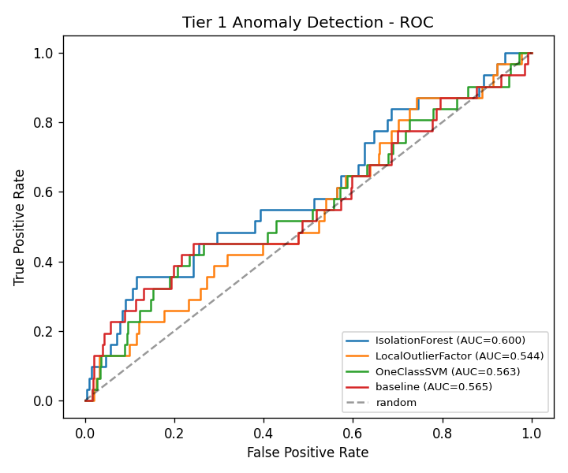
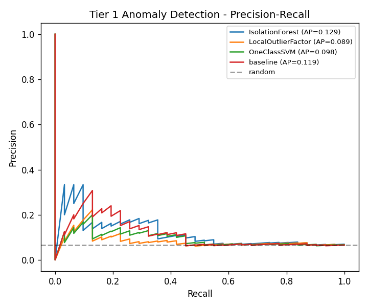

# Tier 1 이상 탐지 - 모델 벤치마크

SECOM 데이터셋(반도체 제조 공정 센서)으로 비지도 이상 탐지 모델을 비교합니다.

## 설정

- train 1096 / test 471 (70/30 stratified split)
- test의 fail(이상) 샘플: 31건
- 전처리: 전결측/상수 컬럼 제거 -> 중앙값 임퓨테이션 -> 표준화
- 평가 지표: ROC-AUC, PR-AUC (불균형 데이터라 PR-AUC가 주지표)

## 결과 (PR-AUC 내림차순)

| 모델 | ROC-AUC | PR-AUC |
|---|---|---|
| IsolationForest | 0.600 | 0.129 |
| baseline | 0.565 | 0.119 |
| OneClassSVM | 0.563 | 0.098 |
| LocalOutlierFactor | 0.544 | 0.089 |

## 채택

PR-AUC 기준 최고 모델은 **IsolationForest** (PR-AUC 0.129), agents/detection.py의 baseline으로 사용합니다.
