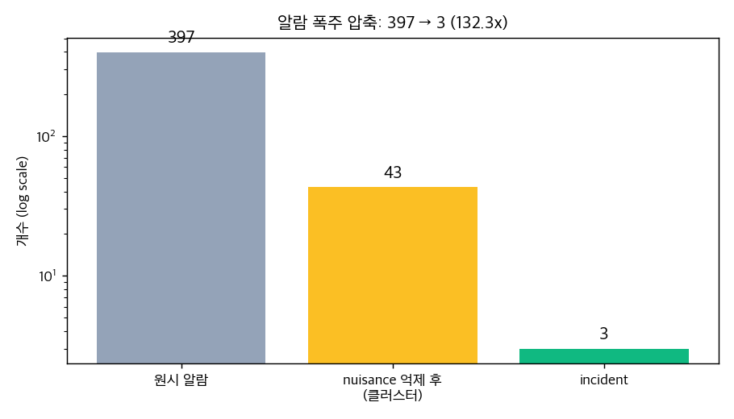
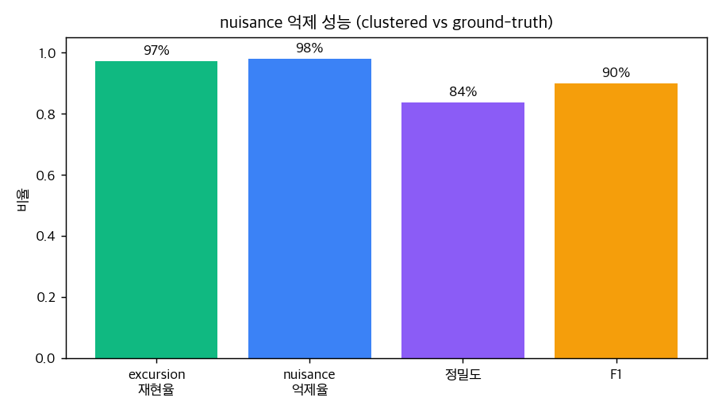
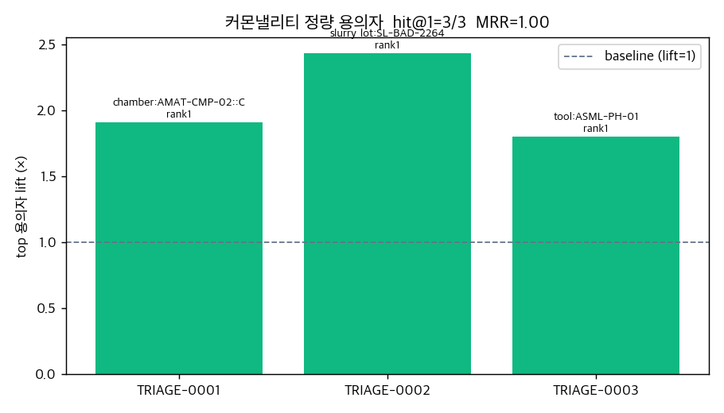

# D12: Tier 0 트리아지 + 커몬낼리티 엔진

FDC 알람 폭주(알람 피로)와 수작업 RCA(데이터 고고학)를 자동화한 Tier 0 계층의
정량 평가입니다. LLM 호출 없는 결정론 파이프라인이라 100% 재현됩니다(seed 고정).

## 실험 설정

- 합성 FDC 스트림: 알람 **397건** (진짜 excursion 37 / nuisance 360, planted incident 3건)
- MES genealogy: 웨이퍼 600장, 각 incident마다 root-cause 엔티티 심음
- 트리아지·커몬낼리티 모두 정답(_truth)을 보지 않음, 평가 단계에서만 대조

## 1. 알람 압축 (알람 피로 해소)

| 지표 | 값 |
|---|---|
| 원시 알람 | 397 |
| nuisance 억제 | 354 |
| 최종 incident | **3** |
| **압축비** | **132.3x** |

## 2. nuisance 억제 성능

clustered(=incident에 포함) / suppressed 분류를 ground-truth와 대조:

| 지표 | 값 |
|---|---|
| excursion 재현율 (recall) | **97%** |
| nuisance 억제율 | **98%** |
| 정밀도 (precision) | 84% |
| F1 | 0.90 |
| 혼동행렬 (TP/FP/FN/TN) | 36/7/1/353 |

## 3. 트리아지 랭킹 (precision@k / recall)

- precision@3: **100%** (상위 3개 incident가 모두 진짜 excursion)
- recall: **100%** (planted 3건 중 덮은 수)

| rank | incident | risk | kind | 알람수 | → planted |
|---|---|---|---|---|---|
| 1 | CMP MRR 이상 - AMAT-CMP-02 | 90.7 | tool | 16 | INC-SYN-CMP-CHAMBER |
| 2 | CMP 제거 균일도 이상 - AMAT-CMP-02 외 1대 | 75.6 | systemic | 16 | INC-SYN-SLURRY-LOT |
| 3 | Photo Focus 편차 이상 - ASML-PH-01 외 1대 | 68.8 | systemic | 11 | INC-SYN-PHOTO-PM |

## 4. 커몬낼리티 정량 용의자 (데이터 고고학 자동화)

- hit@1: **3/3**, hit@3: 3/3, MRR: **1.00**

| incident | 정답 root-cause | top 용의자 | hit rank | lift | p-value |
|---|---|---|---|---|---|
| TRIAGE-0001 | chamber:AMAT-CMP-02::C | chamber:AMAT-CMP-02::C | 1 | 1.91x | 5.0e-04 |
| TRIAGE-0002 | slurry_lot:SL-BAD-2264 | slurry_lot:SL-BAD-2264 | 1 | 2.43x | 5.1e-07 |
| TRIAGE-0003 | tool:ASML-PH-01 | tool:ASML-PH-01 | 1 | 1.8x | 8.1e-08 |

## 5. baseline 대비 (클러스터링의 가치)

sigma 단순 정렬 상위 9개 알람만 보면 3건 중 **2건**만 덮음 (나머지는 강한 단발 nuisance에 묻힘).
트리아지는 클러스터링으로 **100%** 전부 표면화.

## 결론

- 알람 **397→3건(132.3x)** 압축, nuisance 98% 억제하면서 진짜 이상 97% 보존
- 커몬낼리티가 불량 공통원인을 hit@1 3/3로 자동 지목 → 수작업 RCA(수시간)를 통계로 대체
- 전 과정 결정론·감사가능: 랭킹 근거(severity/spread/confidence, lift/p)를 모두 노출